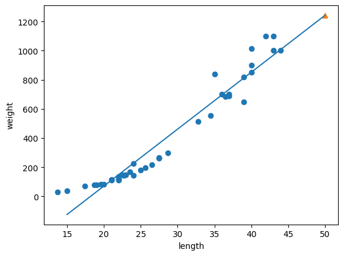
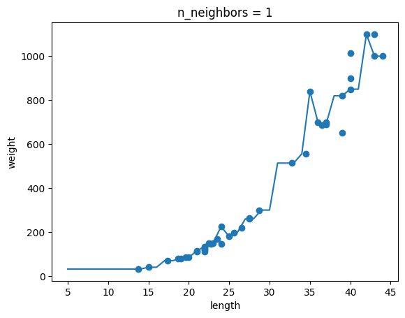

# encore_skn11

### **sk 네트웍스 famliy ai camp를 진행하면서 배우고 실습한 코드를 기록하고 정리하는 공간(Mechine-Learning)**

---

- 3월 6일 목요일 - 머신러닝 - 개요
    - 머신 러닝 절차 
        1. 데이터 로드 및 데이터 정제
        2. EDA 
            - 데이터 분석
        3. 전처리
            - 데이터 스케일링, 표준화 및 정규화
            - 인코딩
            - 피처 스케일링
        4. 데이터 분휴
            - 학습 데이터 : 트레레이닝 데이터 = 7 : 3
        5. 모델 선정
        6. 학습
        7. 평가
        8. 피드백

---

- 3월 7일 목요일 - 머신러닝 - k-최근접이웃모델
    - 가까운 아웃을 찾아 예측
    - 학습과정이 없음
        - 데이터를 저장
        - 값이 들어오면 가장근접한 이웃 k를 선정
        - k개 중에 많이 나온 것이 값으로 반환
    - 데이터를 많이 차지함
    - 주어진 데이터를 크게 벗어난 값이 나와도 K개만 뽑아서 하기 때문에 값이 정확하지 않다
        - EX) 길이가 30까지 밖에 데이터 셋에서 값으로 50, 100을 주면 둘 다 똑같은 무게를 알려준다.

---

- 3월 8일 금요일 - 머신러낭 - 선형회귀
    - 데이터를 학습해 수식으로 예측 
    - overfiting이 되지 않도록 주의해야 함
        - overfiting 이란
            - 학습한 그래프가 
            
            이런식으로 나와야 하지만
            
            이런식으로 training 데이터에만 딱 맞는 상태

--- 

- 3월 11일 월요일 - 머신러닝 - EDA

1. 데이터 로드
    - 다양한 소스에서 데이터를 로드한다. (파일, 데이터베이스, API 등에서 데이터를 불러온다.)
    - 데이터가 로드된 후에는 구조를 확인하기 위해 첫 몇 줄의 데이터를 출력해 본다.
2. 데이터 구조 및 기초 통계 확인
    - 데이터의 구조를 파악하기 위해 컬럼 정보와 데이터 타입을 확인한다.
    - 데이터의 기본 통계 정보를 출력하여 각 변수의 분포와 특성을 살펴본다.
    - df.head(), df.info(), df.describe() 등의 함수를 사용한다.
3. 결측치 및 이상치 탐색
    - 결측치(NaN) 값이 존재하는지 확인하고, 이를 처리하는 방법을 결정한다.
    - 데이터에 존재하는 이상치(Outlier)를 탐지하고, 이를 어떻게 처리할지 결정한다.
    - df.isnull().sum(), df.boxplot() 등의 함수를 활용한다.
4. 데이터 시각화를 통한 탐색
    - 데이터를 시각화하여 변수 간의 관계, 분포 등을 파악한다.
    - 히스토그램, 박스플롯, 상관관계 행렬 등 다양한 그래프를 통해 데이터의 특성을 시각적으로 확인한다.
    - sns.countplot(), sns.heatmap() 등의 함수를 사용한다.
5. 데이터 정제 및 전처리
    - 필요 없는 변수나 중복 데이터를 제거한다.
    - 범주형 데이터를 처리하거나, 스케일링 및 정규화를 통해 모델에 적합한 형태로 데이터를 변환한다.
    - df.drop(), df.fillna(), pd.get_dummies() 등의 함수를 활용한다.
6. 데이터 변환 및 피처 엔지니어링
    - 새로운 피처를 생성하거나 기존 피처를 변환하여 분석에 적합한 형태로 데이터를 조정한다.
    - 로그 변환, 다항식 피처 추가 등 다양한 기법을 통해 데이터를 변환할 수 있다.
    - np.log(), PolynomialFeatures() 등의 함수를 활용한다.
7. 데이터 분할
    - 학습용과 테스트용 데이터로 분할한다.
    - 이 과정은 모델을 평가하고 성능을 검증하는 데 중요한 단계이다.
    - train_test_split() 함수를 사용한다.

---

- 3월 12일 화요일 - 머신러닝 - 경사하강법

- 경사하강법(gradient descent)
    - 기울기가 0이 되는 지점을 찾아 가는 것 
- 배치 경사 하강법
    - 장점: 안정적인 수렴을 보이며, 최적의 방향으로 이동할 수 있다.
    - 단점: 대규모 데이터셋에서는 계산 비용이 높고 메모리 사용량이 많다
- 확률적 경사 하강법
    - 장점: 대규모 데이터셋에서도 빠르게 업데이트가 가능하며, 지역 최적점에 빠지지 않고 전역 최적점을 찾을 가능성이 있다.
    - 단점: 업데이트에 노이즈가 많아 수렴이 불안정할 수 있다.
- 미니 배치 경사 하강법
    - 장점: 배치 경사 하강법과 확률적 경사 하강법의 장점을 모두 가지며, 효율적인 연산이 가능하다.
    - 단점: 배치 크기 선택에 따라 성능이 달라질 수 있다.

---

- 3월 12일 화요일 - 머신러닝 - 과대 적합

- 과대적합 (overfitting)
    - 모델이 훈련 데이터에 지나치게 최적화되어 새로운 데이터에 일반화 되지 않은 상태
    - 훈련 데이터에 대한 평가는 좋지만 테스트 데이터에 대한 평가가 떨어지는 상태
    - 훈련 데이터의 잡음까지 학습된 상태
    - 해결 방법
        - 데이터셋의 복잡도 줄이기
        - 학습할 데이터의 양 늘리기
        - L1, L2가 적용된 규제 모델 사용하

- 과소적합 (underfitting)
    - 모델 훈련이 덜 된 상태
    - 속성을 제대로 분석하지 못한 상태
    - 훈련 데이터에 대한 평가조차 좋지 않은 상태
    - 해결방법
        - 학습할 데이터를 추가 제공하기
        - 특성을 추가해 복잡한 패턴을 학습시키기

---

- 3월 12일 화요일 - 머신러닝 - 결정트리

- 스무고개처럼 질문/결정을 통해 데이터를 분류하는 모델
    - 데이터 스케일링 영향이 적음
    - 선형 구조가 아닌 복잡한 구조의 데이터에 적합
    - 과대적합 되기 쉬움 -> 가지치기 등을 통해 과대적합 방지(max-depth)

---

- 3월 13일 수요일 - 머신러닝 -서포트 백터 머신

| 특징                   | SVM                                    | SVR                                    |
|----------------------|---------------------------------------|---------------------------------------|
| **목적**              | 이진 분류 문제 해결                   | 연속적인 값 예측                      |
| **결정 경계**         | 서포트 벡터와의 거리를 최대화하여 생성 | 데이터 포인트와의 오차를 최소화하여 생성 |
| **마진/허용 오차**    | 마진을 최대화하여 일반화 성능 향상    | ε 매개변수로 허용 오차 범위 설정       |
| **결과**              | 클래스 예측 (이진 분류)               | 연속적인 값 예측                      |

---

- 3월 14일 목요일 - 머신러닝 - 앙상블

- 투표 
    - hard
        - 다수결
    - soft 
        - 평균
- 배깅
    - 복원 추출
    - 랜덤 포레스트 
        - 여러 결정 트리를 생서하여 평균 또는 다수결로 결과를 도출 하는 학습 방법
        - 장점
            - 여러 트리의 결과를 평균화하여 과대적합 위험을 줄인다.
            - 특성의 중요도를 계산할 수 있어 해석 가능성이 높다.
            - 비선형 데이터나 복잡한 데이터에서도 강력한 성능을 보인다.
- 페이스팅
    - 비복원 추출
- 부스팅
    - 순차적으로 하습하여 이전 학습의 잘 못된 점을 보완해나아가는 학습 방법
    - XGBoost
        - 트리 기반의 앙상블 학습모댈 (가장 인기 많음)
        - 장점: 다른 모델 대비 성능이 매우 좋다.
        - 단점: 성능이 좋은 만큼 파라미터가 늘어나면 속도가 늦어진다.
            - ⇒ 다른 모델에 비해 압도적 성능을 보이므로 단점을 감안하고 사용한다. (결과를 좌우하는 중요한 지표들을 XGBoost가 찾아준다.)
    - LightGBM
        - XGBoost보다 빠름
        - XGBoost 보다 메모리 사용량도 적다
        - 과적합을 주의 해야된다

---

- 3월 14일 금요알 - 머신 러닝 - 처원 축소

-  PCA vs LDA vs LLE 상세 비교표

| 구분 | PCA(주성분 분석) | LDA(선형 판별 분석) | LLE(국소적 선형 임베딩) |
|------|--------------------------|------------------------------|-------------------------------|
|  **목적** | 데이터의 **분산이 가장 큰 방향**으로 차원 축소 | 클래스 간 **구분이 잘 되는 방향**으로 차원 축소 | 데이터의 **국소적인 구조**를 보존하면서 차원 축소 |
|  **학습 방식** | **비지도 학습** (레이블 없음) | **지도 학습** (레이블 필요) | **비지도 학습** |
|  **포커스** | 전체 데이터의 **정보(분산) 최대 보존** | 서로 다른 클래스 간의 **분리 극대화** | 이웃 간의 **관계(거리, 구조) 보존** |
|  **적용 목적** | 데이터 시각화, 노이즈 제거, 사전 처리 | 분류 문제의 전처리, 시각화 | 복잡한 구조를 가진 데이터(예: 나선형) 시각화 |
|  **수학적 기반** | 공분산 행렬 → 고유값 분해 (Eigen Decomposition) | 클래스 간/내 분산비 → 고유값 분해 | 이웃의 선형 조합 → 저차원에서 구조 유지 |
|  **출력 차원 수** | 원하는 만큼 지정 가능 | 최대 `클래스 수 - 1` | 원하는 만큼 지정 가능 |
|  **레이블 필요 여부** | ❌ 없음 | ✅ 있음 | ❌ 없음 |
|  **선형/비선형** | 선형 | 선형 | **비선형** |
|  **시각화 가능 여부** | ✅ 가능 (2D, 3D) | ✅ 가능 (2D, 3D) | ✅ 가능 (2D) |
|  **대표적 사용 예시** | 이미지 압축, 데이터 사전 처리 | 얼굴 인식, 행동 분류(HAR) | 나선형 데이터, 복잡한 구조의 시각화 |
|  **주의할 점** | 분산은 크지만, **의미 있는 구분이 아닐 수 있음** | 차원 수 제한 (`클래스 수 - 1`) | 느릴 수 있고, 데이터 밀도에 민감 |

- 상황별 요약

| 상황 | 추천 차원 축소 기법 |
|------|--------------------|
| 라벨 없이 데이터 전체의 분산을 보존하고 싶다 | ✅ PCA |
| 라벨이 있고, 클래스 구분을 잘 하고 싶다 | ✅ LDA |
| 데이터가 복잡한 곡선 구조를 가진다 (예: 나선형) | ✅ LLE |

---

- 3월 18일 화요일 - 머신러닝 - 정밀도, 재현율, f1-score
    - 정밀도
        - 모델이 양성이라고 예측 했고 실제로도 양성인 비율
    - 재현율
        - 실제 양성인 것중에 모델이 양성이라고 예측한 비율
    - f1-socre
        - 정밀도와 재현율의 비율이 적절한지