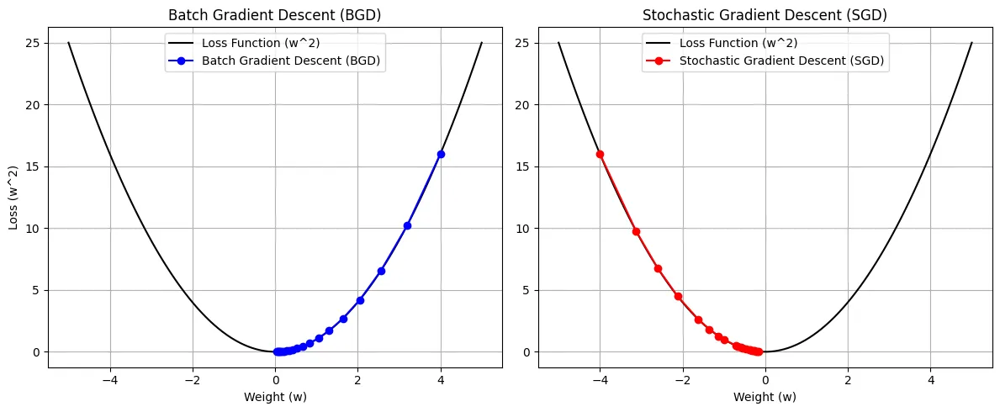
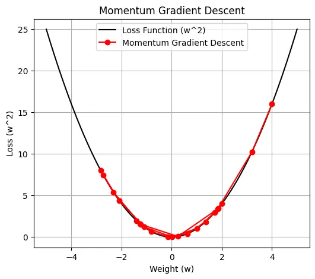
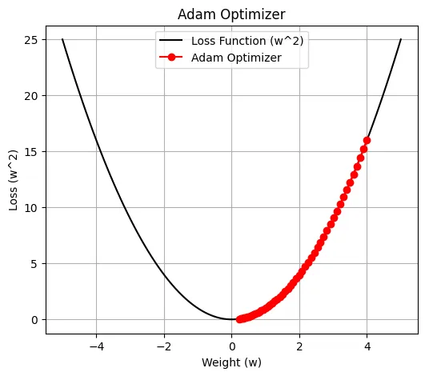

# encore_skn11

### **sk 네트웍스 famliy ai camp를 진행하면서 배우고 실습한 코드를 기록하고 정리하는 공간(Deep-Learning)**

---

- 머신러닝 VS 딥러닝 

| **구분** | **머신러닝(Machine Learning)** | **딥러닝(Deep Learning)** |
| --- | --- | --- |
| **정의** | 데이터를 학습하여 패턴을 찾고 예측하거나 분류하는 알고리즘 | 인공신경망(ANN)을 기반으로 데이터에서 고차원 특징을 학습 |
| **특징 추출** | 사람이 직접 특징을 추출해야 함 (Feature Engineering 필요) | 데이터에서 특징을 자동으로 추출 |
| **데이터 의존성** | 상대적으로 적은 데이터로도 학습 가능 | 많은 양의 데이터 필요 |
| **학습 방식** | 전통적인 알고리즘 (SVM, Decision Tree, Random Forest 등) 사용 | 딥러닝 모델(예: CNN, RNN, Transformer) 사용 |
| **처리 속도** | 일반적으로 빠르며, 가벼운 계산 | 모델이 복잡하고 계산량이 많아 GPU와 같은 고성능 HW 필요 |
| **적용 사례** | 비교적 간단한 문제 (예: 가격 예측, 스팸 분류) | 복잡한 문제 (예: 이미지/음성 인식, 자연어 처리) |
| **모델 구조** | 비교적 단순하고 해석이 용이 | 복잡한 계층 구조로 구성되어 해석이 어려움 |
| **기술 성숙도** | 오래된 기술로 안정적이고 검증됨 | 상대적으로 최근 기술, 빠르게 발전 중 |
| **연산 자원** | 일반 CPU로도 학습 가능 | GPU, TPU 같은 고성능 하드웨어 필수 |
| **오버피팅 경향** | 데이터가 적으면 오버피팅 가능성 적음 | 데이터가 부족할 경우 오버피팅 가능성 큼 |

---

- 딥러닝의 주요 알고리즘
    - CNN
        - 이미지 처리
    - RNN
        - 자연어 처리나 시계열 데이터 분석
    - GAN 
        - 생성기와 판독기
    - Transformer
        - 자연어 처리의 가장 중요

---

- 3월 17일 월요일 - 딥러닝 -퍼셉트론
    - 논리 게이트(선형)
        - AND/NAND/OR
        - 둘다, 둘다 0이여야 0, 둘중하나라고 1이면 1
    - XOR은 해결 하지 못함(비선형)
    - 가중치 : 입력에 대해 얼마나 중요한지 결정하는 값
    - 편향 : 출력 값을 조정하는 역할
    - 다층 퍼셉트론
        - 비선형 XOR 해결
    

---

- 3월 18일 화요일 - 딥러닝 - 활성화 함수
    - 시그모이드
        - 출력 범위 (0, 1)
        - 기울기 소실 문제 발생 가능
    
    - 계단
        - 이진분류
        - 0 이상이면 1, 이하면 0
    
    - ReLU
        - 출력 범위 (0 ~ 무한대)
        - 음수에 대해 0을 출력하여 단순 계산하여 학습 속도가 빠름
        - 죽은 뉴런 문제 발생 가능
    
    - Leaky ReLU
        - 출력 범위 (- 무한대, 무한대)
        - LeRU의 죽은 뉴런 문제를 해결하기 위해 
    
    - Tanh
        - 출력범위  (-1, 1)
        - 시그모이드보다 중심이 0에 가까워 더 빠른 학습 진행 가능
        - 기울시 소실 문제 발생 가능
    

---

- 3월 19일 수요일 - 딥러닝 - 소프트맥스
    - 소프트맥스
        - 합이 1이 된다
        - 분류에 사용
    

---

- 3월 20일 목요일 - 딥러닝 - 손실 함수
    - MSE
        - 실제 값과 예측값의 차이를 제곱하여 평균 낸 것 -> 제곱을 하기 떄문에 미세하게 조정
        - 이상치에 민감
    - MAE
        - 실제 값과 예측값의 차이의 절대값을 평균 낸 것 -> 그냥 차이 만큼
        - 이상치에 덜 민감 -> 미분이 어려워 최적화가 힘듬
    - Huber
        - MSE와 MAE의 장점을 합쳐 둔거
        - 오차가 작을땐 부드럽게(MSE) 오차가 크면 단호하게(MAE) 처럼
    - CEE
        - 분류 문제에서 사용
        - 실제값이 특정 클래스에 속할 확률과 예측 확률을 비교하여 손실을 계산
    - Mini-batch
        - 전체 데이터가 아닌 무작위로 선택하여 학습하는 방법
        
---

- 3월 24일 월요일 - 딥러닝 - 오차역전파
    - 순서
        1. 순전파
        2. 손실 계산
        3. 역전파
        4. 가중치 업데이트
    - 오차역전파의 핵심  **연쇄법치(Chain Rule)**
        1. 손실 함수 L에 대해 출력층 a의 미분
        2. 출력층에서 은닉층으로 전파
        3. 경사하강법을 이용한 가중치 업데이트

---

- 3월 25일 화요일 - 딥러닝- 경사하강법
    - SGD
    
    - 모멘텀
    
    - AdaGrad
    - RMSprop
    - Adam
    

| 알고리즘   | 핵심 개념 | 장점 | 단점 | 주요 하이퍼파라미터 |
|------------|-----------|------|------|----------------------|
| **SGD** | 각 반복마다 무작위 샘플(또는 미니배치)의 기울기 사용 | 구현 간단, 일반화 성능 좋음 | 진동 큼, 수렴 느림 | 학습률 (lr) |
| **모멘텀** | 이전 업데이트 방향을 반영해 관성 부여 | 진동 감소, 수렴 속도 증가 | 모멘텀 계수 조정 필요 | 학습률 (lr), 모멘텀 (β) |
| **Adagrad** | 파라미터마다 학습률 조절 (기울기 제곱 누적) | 희소한 데이터에 강함 | 학습률이 너무 빨리 작아짐 | 학습률 (lr), ε |
| **RMSProp** | 기울기 제곱의 이동 평균 사용 | Adagrad의 단점 해결, 안정적 수렴 | 초기화/감쇠율 민감 | 학습률 (lr), decay (ρ), ε |
| **Adam** | 모멘텀 + RMSProp 결합 | 거의 대부분의 문제에서 잘 작동 | 과적합 가능성, 튜닝 필요 | 학습률 (lr), β1, β2, ε |

---

- 3월 26일 화요일 -딥러닝- 과적합 해결
    - 배치 정규화
        - 각 층마다 입력되는 데이터의 분포를 정규화 시켜주는 기법
    - 드롭아웃
        - 학습 과정에서 랜덤하게 일부 뉴런 제거
        - 테스트 과정에서는 모든 뉴런 활성화
    - 하이퍼파라미터 최적화
        - 그리드 서치
        - 랜덤 서치
        - 베이지안 최적화
    - 조기 종료
        - loss 값이 줄어 들지 않을 때 종료
    - 데이터 증강
        - 훈련 데이터를 인위적으로 늘려 모델이 다양한 패턴을 학습하도록 유도
    - L1, L2 정규화
        - 신경망의 가중치가 너무 커지면 특정 뉴런에 대한 의존성이 증가해 과적합이 일어난다
        - L1 정규화 :  가중치의 걸대값을 기준으로 패널티 부여
        - L2 정규화 : 가중치의 제곱을 기준으로 패널티 부여