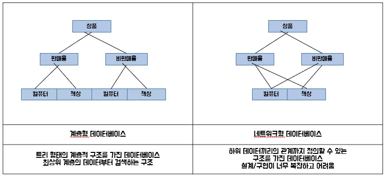
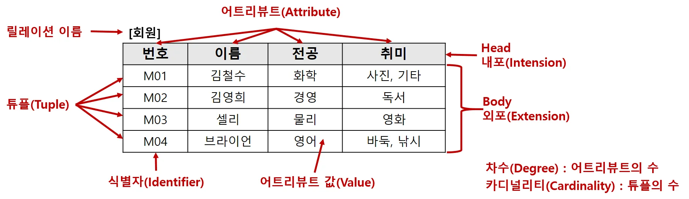
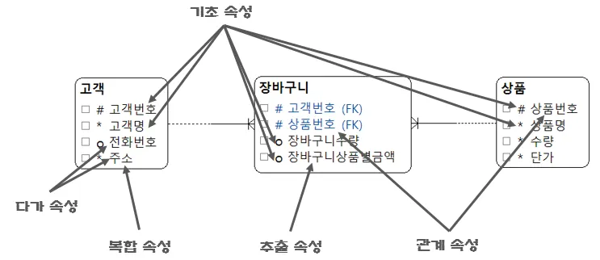
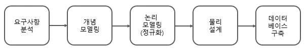
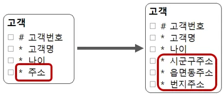

# encore_skn11

### **sk 네트웍스 famliy ai camp를 진행하면서 배우고 실습한 코드를 기록하고 정리하는 공간(Data base 부분)**

---

 - 2월 18일 화요일 - DataBase 개요
    - 정의
        - 운영 데이터
        - 공용 데이터
        - 통합 데이터
        - 저장 데이터
    - 특징
        - 실시간 접근성
        - 계속적인 변화
        - 동시 공유
        - 내용에 따른 참조
    - DBMS(Database Management System)
        - 데이터베이스 전용 관리 프로그램
        - DB랑 DBMSSMS 다른것 
            - DB는 실제 데이터의 집합 
            - DBMS 데이터베이스를 관리하고 제어하는 프로그램
        - 기능
            - 데이터 추출(DBMS)
            - 데이터 조작(DBMS)
            - 데이터 정의(DDL)
            - 데이터 제어
        - DBMS의 사용 이점
            - 데이터 중복 최소화
            - 쿼리 언어(SQL문)
            - 데이터 무결성
            - 데이터 백업 및 복구
            - 표준화
        - 종류와 특징

| 데이터베이스 | 제조사            | 기반 운영체제                                  | 용도                         |
|-------------|-----------------|--------------------------------|----------------|
| SQL Server | MS              | 윈도우                         | 윈도우 기반 기업용          |
| Oracle     | Oracle          | 윈도우, 유닉스, 리눅스        | 대용량 데이터베이스(금유권에서 많이 사용), 유료         |
| MySQL      | Oracle          | 윈도우, 유닉스, 리눅스        | 소용량 데이터베이스(학습용으로 먾이 사용), 무료         |
| DB2        | IBM             | 유닉스                         | 대용량 데이터베이스         |
| SQLite     | D.Richard Hipp (오픈소스) | 유닉스, 모바일 OS (안드로이드, iOS 등) | 모바일 전용 데이터베이스 |

DBMS 동작 원리 

DBMS 변천사 

관계 데이터 모델이 가장 오래 사용, 우리도 관계 데이터 모델로 학습한다.

- 계층형 데이터베이스 
    - 트리 형태를 가지고 부모-자식으로 내려오는 구조 
- 네트워크형 데이터베이스 
    - 복잡한 구조를 가짐
    - 계층형보다 복잡한 구조에 용이 
    - 구조가 복잡해서 이해하기 어렵다 

- 관계형 데이터베이스 
    - 데이터를 테이블 형태로 저장한다.(행과 열) 

| 장점 | 잔점          | 
|-------------|-----------------|
| 데이터 무결성을 유지하는데 효과적이다.  | 복잡한 객체 관계를 표현하는데 한계가 있다.            | 
| 강력한 SQL을 통해 복잡한 데이터 조작이 가능하다   |  스키마 변경이 어렵고 비용이 많이 든다         | 
| 데이터 정규화를 통해 중복을 최소화 한다      |          | 

- 객체- 관계형 데이터베이스 
    - 객체 지향 기능을 활용 할 수 있다
    - 복잡한 데이터 타입과 객체 지향 프로그래밍을 지원한다
    - 구현이 복잡하고,  관리가 어렵다

---

- 2월 18일 화요일 - MySQL 개요
    - MySQL 이란
        - 오픈 소스 관계형 데이터베이스 관리 시스템(RDBMS)
    - MySQL 특징

    | **특징** | **내용** |
    | --- | --- |
    | **오픈소스** | 소스 코드를 사용자가 자유롭게 보고 개선 사항을 제안하고 코드에 기여할 수 있다. |
    | **효율성과 성능** | 속도와 효율성에 중점을 두고 설계되어 높은 성능을 제공하며 대규모 웹 사이트와 어플리케이션에 사용하기 적합하다. |
    | **다양한 운영체제 지원** | MySQL은 Windows, Linux, macOS 등 다양한 운영체제에서 작동한다. |
    | **보안** | MySQL은 여러 보안 기능을 제공하여 데이터 무결성과 보안을 보장한다. |
    | **다양한 저장 엔진** | MySQL은 다양한 저장 엔진을 제공한다. 대표적으로 InnoDB와 MyISAM이 있다. |
    | **트랜잭션 처리 지원** | MySQL은 InnoDB 및 NDB Cluster 저장 엔진을 통해 ACID(원자성, 일관성, 고립성, 지속성)를 준수하는 트랜잭션을 지원한다. |    
    
    - MySQL동작원리 
    
    

    1. 클라이언트 / 서버통신
        - MySQL 서버로 전송한다 
    2. 쿼리 파싱 
        - 문장의 문법이 유효한지, 키워드가 올바른지. 존재하는 테이블인지를 확인한다
    3. 최적화 및 실행 계획 생성
        - 실행계획을 생성 
    4. 쿼리 실행
        - 실제 데이터베이스 파일 또는 인덱스에 접근한다.
    5. 결과 반환
        - MyAQL 서버가 결과 세트를 클라이언트에게 반환 한다 

---

- 2월 18일 화요일 - 데이터베이스 모델링1
    - 모데링의 특징
        - 단순화
        - 추상화
        - 명확화
    - 데이터 모델링의 필요성
        - 파일 저장 
            - 데이터가 소멸되지 않게 디스크에 파일 형식으로 저장하고 읽고 쓴다.
        - 관계형 데이터 베이스 저장
            - **중복을 제거** 
            - 각 데이터들의 종류를 한눈에 파악하기 쉽다
            - 데이터 간의 관계를 통해 연관 있는 데이터들이 어떻게 누적되어 가는지 하눈에 파악하기 쉽다.
        - 관계형 데이터베이스 설계 
            - 데이블 별로 기준을 만들고 어떠한 관계 어떠한 의미를 가지고 있는지 연관관계를 가지고 설계를 한다 
    - 개발 절차에 따른 정보 시스템 구축 절차

        

        - 폭포수 모델 방식의 소프트워어 개발 절차는 요구사항 분석, 설계, 구현, 테스트, 튜닝, 유지보수 이다. 
        - 데이터 관점 모델링
            - 어떤 것과 관련 있는지, 데이터 간의 관계, 튜닝까징 과정에 포함이 된다.
    - 데이터 모델 표기법 
        - Barker 표기법 VS IE 표기법

            
            
            - 선과, 끝부분의 바를 잘보자
                - 실선(필요) 둘다 무조건 매칭, 점선(참조) 매칭이 안돼도 상관 없다
            - 범용은 IE 표기법 
            - 우리는 Barker 표기법을 사용 할 것이다.
    - 관계형 모델(Relational Model)
        - 
             - 릴레이션 이름 = 테이블 명 
             - 식별자 = PK
             - 어트리뷰트 값 = 식별자 값을 제외 한 값
    - 무결성
        - **관계형 모델에서 가장 중요**
        - 데이터가 모순없이 일관 되게 일치하면서 데이터가 **틀리지 않고 정확** 해야 한다. 
        - 종류 및 설명 

            | **무결성 종류** | **무결성 특징** |
            | --- | --- |
            | 엔터티 무결성(Entity Integrity) | 모든 인스턴스는 고유해야 하며 인스턴스를 대표하는 속성에는 널 값을 가지면 안된다는 의미 |
            | 참조 무결성(Referentail Integrity) | 엔터티의 외래 식별자 속성은 참조하는 엔터티의 주 식별자 값에 포함되거나 널이어야 함을 의미 |
            | 도메인 무결성(Domain Integrity) | 속성 값과 관련된 것으로 특정 속성 값은 같은 데이터 타입, 길이, 널 여부, 중복 값 허용, 기본 값 등 동일한 범주의 값만 존재해야 함을 의미 |
            | 업무 무결성(Business Integrity) | 기업에서 업무를 수행하는 방법이나 데이터를 처리하는 규칙을 의미 |   

            - 테이블을 만들때에는 **무결성규칙**을 위배하지 않도록 주의해서 만들어야 된다. 

---

- 2월 18일 화요일 - 데이터베이스 모델링2
    - 엔터티 
        - 업무의 관심 대상이 되는 정보를 갖고 있거나 그에 대한 정보를 알아야 하는 유,무형의 개체
    - 엔터디 도출 
        - 업무 관심 대상
        - 두 개 이상의 인스턴스(개체)
        - 데이터 정체성이 분명
        - 식별자가 존재 
        - 동일한 성격의 데이터는 X 하나만 가능
        - 엔터티 명은 관리하고자 하는 성격을 가장 잘 표현한 이름 이여야 한다. 
    - 엔터티 종류 
        - 실체 엔터티
        - 기준 엔터티
        - 행위 엔터티
        - 가공 엔터티
    - 속성
        
        - 단일 속성
            - 하나의 의미로 구성 된 속성
            - ex) 부서명, 상품명
        - 복합 속성
            - 두 개 이상의 세부속성으로 구성된 속성
            - ex) 주소(시, 구, 동)
        - 다가 속성
            - 속성이 여러 값을 지니는 속성
            - ex) 주문 내역, 입출고 내역, 걀제 내역
        - 기초 속성
            - 기초 속성만으로 엔터티가 어떤 성격을 지니고 있는지 알아볼 수 있어야 한다.
        - 관계 속성
            - FK 다른 엔터티와의 연관성을 나타내는 속성
        - 추출 속성
            - 원본 속성의 값을 계산해서 채우는 속성
            - ex) 상품의 총 금액
    - 식별자 
        - 주식별자
            
            - 유일성
            - 최소성
            - 불변성
            - 존재성
                - NULL 허용 X
            - 주식별자는 여러개 일 수 이다, 
        - 외래식별자
            - 부모와 자식 두 엔터티에서 부모의 주식별자가 자식에게는 외래식별자가 된다.  
    - 관계
        - 카디널리티
            - 1:1 (이런경우는 거의 없음,  조회할때 시간 낭비를 하기 때문)
            - 1:N (이런경우가 대부분, 굳)
            - N:M (이런경우는 거의 없음, 잘 못 만들었을 가능성이 높음)
        - 옵셔널리티
        - 관계 디그리
    - 특별한 관계
        - 일대일 관계 
            
            - 필요한 상황이 아니라면 일대일 관계를 만들지 않는다
            - Join 할 때 시간 낭비 
        - 베타 관계 
            
            - 프로젝트에서 할 일은 거의 없다 
        - 재귀 관계 
            
            - 레벨이 존재하지 않는 데이터에서 사용 
            - ex) 나 사원 사수 사원 

---
 
 - 2울 18일 화요일 - 데이터베이스 모델링 3
    - 개념 모델
        
        - 요구을 이해하는 관계자들이 이해할 수 있도록 데이터로 간결하게 표현하는 것
        - 충분한 의사소통이 필요하다

--- 

- 2월 18일 화요일 - 데이터베이스 모델랑 4
    - 이상 
        - 삽입 이상
            - 필요한 속성을 넣지 않고 삽입을 하는 것
        - 갱신 이상
            - 속성 값이 바뀔때 동일 한 속성 값이 모두 바뀌지 않는것
        - 삭제 이상
            - 상품을 삭제할때 주문내역도 삭제 되는 것
            - 주문내역을 삭제할때 상춤도 삭제 되는 것
    - 논리 모델
        - 정규화를 진행하는 단계
        - 중복값을 제거하여 이상현상을 제거하기 위해 속성 간에 종속 관계를 확인하고 엔터티를 분할한다. 
        - 빠짐없이 정확하게 반영해야 한다.
        - 삭제할 엔터티나 속성이 없어야 한다.
        - 지나치게 성능 문제를 해걀할고 하지 않는다(정확성이 우선)
    - 정규화
        - 중복데이터 제거
        - 안정성
        - 확장성
        
        - 1정규형 (반복 속성 제거)
            - 다가 속성 관련
            
            - 반복 속성 제거
            - 다가속성이 제일 먼저 제거 됨(모든 속성은 반드시 하나의 값을 가져야 한다.)
            - 원자값을 가짐
            - 복합 속성 관련
            
        - 2정규형 
            
            - 부분 함수적 종속 제거, 기본키 그룹에 완전하게 함수적 종속 
        - 3정규형
            
            - 이행적 함수적 종속 제거, 키가 아닌 모든 속성이 기본키에 직접 종속
        - BCMF
            - 후보키가 아닌 결정자 제거
        - 4정규형
            - 다치종속 제거
         - 5정규형 
            - 종인 종속석 이용