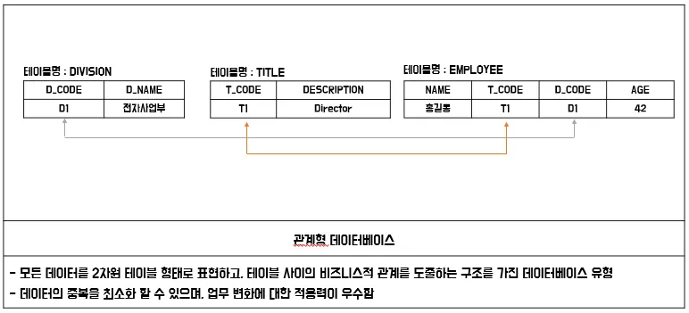

# encore_skn11

### **sk 네트웍스 famliy ai camp를 진행하면서 배우고 실습한 코드를 기록하고 정리하는 공간(Data base 부분)**

---

 - 2월 18일 화요일 - DataBase 개요
    - 정의
        - 운영 데이터
        - 공용 데이터
        - 통합 데이터
        - 저장 데이터
    - 특징
        - 실시간 접근성
        - 계속적인 변화
        - 동시 공유
        - 내용에 따른 참조
    - DBMS(Database Management System)
        - 데이터베이스 전용 관리 프로그램
        - DB랑 DBMSSMS 다른것 
            - DB는 실제 데이터의 집합 
            - DBMS 데이터베이스를 관리하고 제어하는 프로그램
        - 기능
            - 데이터 추출(DBMS)
            - 데이터 조작(DBMS)
            - 데이터 정의(DDL)
            - 데이터 제어
        - DBMS의 사용 이점
            - 데이터 중복 최소화
            - 쿼리 언어(SQL문)
            - 데이터 무결성
            - 데이터 백업 및 복구
            - 표준화
        - 종류와 특징

| 데이터베이스 | 제조사            | 기반 운영체제                                  | 용도                         |
|-------------|-----------------|--------------------------------|----------------|
| SQL Server | MS              | 윈도우                         | 윈도우 기반 기업용          |
| Oracle     | Oracle          | 윈도우, 유닉스, 리눅스        | 대용량 데이터베이스(금유권에서 많이 사용), 유료         |
| MySQL      | Oracle          | 윈도우, 유닉스, 리눅스        | 소용량 데이터베이스(학습용으로 먾이 사용), 무료         |
| DB2        | IBM             | 유닉스                         | 대용량 데이터베이스         |
| SQLite     | D.Richard Hipp (오픈소스) | 유닉스, 모바일 OS (안드로이드, iOS 등) | 모바일 전용 데이터베이스 |

DBMS 동작 원리 

DBMS 변천사 

관계 데이터 모델이 가장 오래 사용, 우리도 관계 데이터 모델로 학습한다.

- 계층형 데이터베이스 
    - 트리 형태를 가지고 부모-자식으로 내려오는 구조 
- 네트워크형 데이터베이스 
    - 복잡한 구조를 가짐
    - 계층형보다 복잡한 구조에 용이 
    - 구조가 복잡해서 이해하기 어렵다 

- 관계형 데이터베이스 
    - 데이터를 테이블 형태로 저장한다.(행과 열) 

| 장점 | 잔점          | 
|-------------|-----------------|
| 데이터 무결성을 유지하는데 효과적이다.  | 복잡한 객체 관계를 표현하는데 한계가 있다.            | 
| 강력한 SQL을 통해 복잡한 데이터 조작이 가능하다   |  스키마 변경이 어렵고 비용이 많이 든다         | 
| 데이터 정규화를 통해 중복을 최소화 한다      |          | 

- 객체- 관계형 데이터베이스 
    - 객체 지향 기능을 활용 할 수 있다
    - 복잡한 데이터 타입과 객체 지향 프로그래밍을 지원한다
    - 구현이 복잡하고,  관리가 어렵다

---

- 2월 18일 화요일 - MySQL 개요
    - MySQL 이란
        - 오픈 소스 관계형 데이터베이스 관리 시스템(RDBMS)
    - MySQL 특징

    | **특징** | **내용** |
    | --- | --- |
    | **오픈소스** | 소스 코드를 사용자가 자유롭게 보고 개선 사항을 제안하고 코드에 기여할 수 있다. |
    | **효율성과 성능** | 속도와 효율성에 중점을 두고 설계되어 높은 성능을 제공하며 대규모 웹 사이트와 어플리케이션에 사용하기 적합하다. |
    | **다양한 운영체제 지원** | MySQL은 Windows, Linux, macOS 등 다양한 운영체제에서 작동한다. |
    | **보안** | MySQL은 여러 보안 기능을 제공하여 데이터 무결성과 보안을 보장한다. |
    | **다양한 저장 엔진** | MySQL은 다양한 저장 엔진을 제공한다. 대표적으로 InnoDB와 MyISAM이 있다. |
    | **트랜잭션 처리 지원** | MySQL은 InnoDB 및 NDB Cluster 저장 엔진을 통해 ACID(원자성, 일관성, 고립성, 지속성)를 준수하는 트랜잭션을 지원한다. |    
    
    - MySQL동작원리 
    
    

    1. 클라이언트 / 서버통신
        - MySQL 서버로 전송한다 
    2. 쿼리 파싱 
        - 문장의 문법이 유효한지, 키워드가 올바른지. 존재하는 테이블인지를 확인한다
    3. 최적화 및 실행 계획 생성
        - 실행계획을 생성 
    4. 쿼리 실행
        - 실제 데이터베이스 파일 또는 인덱스에 접근한다.
    5. 결과 반환
        - MyAQL 서버가 결과 세트를 클라이언트에게 반환 한다 

---

- 2월 18일 화요일 - 데이터베이스 모델링
