# encore_skn11

### **sk 네트웍스 famliy ai camp를 진행하면서 배우고 실습한 코드를 기록하고 정리하는 공간(Data base 부분)**

---

 - 2월 18일 화요일 - DataBase 개요
    - 정의
        - 운영 데이터
        - 공용 데이터
        - 통합 데이터
        - 저장 데이터
    - 특징
        - 실시간 접근성
        - 계속적인 변화
        - 동시 공유
        - 내용에 따른 참조
    - DBMS(Database Management System)
        - 데이터베이스 전용 관리 프로그램
        - DB랑 DBMSSMS 다른것 
            - DB는 실제 데이터의 집합 
            - DBMS 데이터베이스를 관리하고 제어하는 프로그램
        - 기능
            - 데이터 추출(DBMS)
            - 데이터 조작(DBMS)
            - 데이터 정의(DDL)
            - 데이터 제어
        - DBMS의 사용 이점
            - 데이터 중복 최소화
            - 쿼리 언어(SQL문)
            - 데이터 무결성
            - 데이터 백업 및 복구
            - 표준화
        - 종류와 특징

| 데이터베이스 | 제조사            | 기반 운영체제                                  | 용도                         |
|-------------|-----------------|--------------------------------|----------------|
| SQL Server | MS              | 윈도우                         | 윈도우 기반 기업용          |
| Oracle     | Oracle          | 윈도우, 유닉스, 리눅스        | 대용량 데이터베이스(금유권에서 많이 사용), 유료         |
| MySQL      | Oracle          | 윈도우, 유닉스, 리눅스        | 소용량 데이터베이스(학습용으로 먾이 사용), 무료         |
| DB2        | IBM             | 유닉스                         | 대용량 데이터베이스         |
| SQLite     | D.Richard Hipp (오픈소스) | 유닉스, 모바일 OS (안드로이드, iOS 등) | 모바일 전용 데이터베이스 |

DBMS 동작 원리 

DBMS 변천사 

관계 데이터 모델이 가장 오래 사용, 우리도 관계 데이터 모델로 학습한다.

- 계층형 데이터베이스 
    - 트리 형태를 가지고 부모-자식으로 내려오는 구조 
- 네트워크형 데이터베이스 
    - 복잡한 구조를 가짐
    - 계층형보다 복잡한 구조에 용이 
    - 구조가 복잡해서 이해하기 어렵다 

- 관계형 데이터베이스 
    - 데이터를 테이블 형태로 저장한다.(행과 열) 

| 장점 | 잔점          | 
|-------------|-----------------|
| 데이터 무결성을 유지하는데 효과적이다.  | 복잡한 객체 관계를 표현하는데 한계가 있다.            | 
| 강력한 SQL을 통해 복잡한 데이터 조작이 가능하다   |  스키마 변경이 어렵고 비용이 많이 든다         | 
| 데이터 정규화를 통해 중복을 최소화 한다      |          | 

- 객체- 관계형 데이터베이스 
    - 객체 지향 기능을 활용 할 수 있다
    - 복잡한 데이터 타입과 객체 지향 프로그래밍을 지원한다
    - 구현이 복잡하고,  관리가 어렵다

---

- 2월 18일 화요일 - MySQL 개요
    - MySQL 이란
        - 오픈 소스 관계형 데이터베이스 관리 시스템(RDBMS)
    - MySQL 특징

    | **특징** | **내용** |
    | --- | --- |
    | **오픈소스** | 소스 코드를 사용자가 자유롭게 보고 개선 사항을 제안하고 코드에 기여할 수 있다. |
    | **효율성과 성능** | 속도와 효율성에 중점을 두고 설계되어 높은 성능을 제공하며 대규모 웹 사이트와 어플리케이션에 사용하기 적합하다. |
    | **다양한 운영체제 지원** | MySQL은 Windows, Linux, macOS 등 다양한 운영체제에서 작동한다. |
    | **보안** | MySQL은 여러 보안 기능을 제공하여 데이터 무결성과 보안을 보장한다. |
    | **다양한 저장 엔진** | MySQL은 다양한 저장 엔진을 제공한다. 대표적으로 InnoDB와 MyISAM이 있다. |
    | **트랜잭션 처리 지원** | MySQL은 InnoDB 및 NDB Cluster 저장 엔진을 통해 ACID(원자성, 일관성, 고립성, 지속성)를 준수하는 트랜잭션을 지원한다. |    
    
    - MySQL동작원리 
    
    

    1. 클라이언트 / 서버통신
        - MySQL 서버로 전송한다 
    2. 쿼리 파싱 
        - 문장의 문법이 유효한지, 키워드가 올바른지. 존재하는 테이블인지를 확인한다
    3. 최적화 및 실행 계획 생성
        - 실행계획을 생성 
    4. 쿼리 실행
        - 실제 데이터베이스 파일 또는 인덱스에 접근한다.
    5. 결과 반환
        - MyAQL 서버가 결과 세트를 클라이언트에게 반환 한다 

---

- 2월 18일 화요일 - 데이터베이스 모델링1
    - 모데링의 특징
        - 단순화
        - 추상화
        - 명확화
    - 데이터 모델링의 필요성
        - 파일 저장 
            - 데이터가 소멸되지 않게 디스크에 파일 형식으로 저장하고 읽고 쓴다.
        - 관계형 데이터 베이스 저장
            - **중복을 제거** 
            - 각 데이터들의 종류를 한눈에 파악하기 쉽다
            - 데이터 간의 관계를 통해 연관 있는 데이터들이 어떻게 누적되어 가는지 하눈에 파악하기 쉽다.
        - 관계형 데이터베이스 설계 
            - 데이블 별로 기준을 만들고 어떠한 관계 어떠한 의미를 가지고 있는지 연관관계를 가지고 설계를 한다 
    - 개발 절차에 따른 정보 시스템 구축 절차

        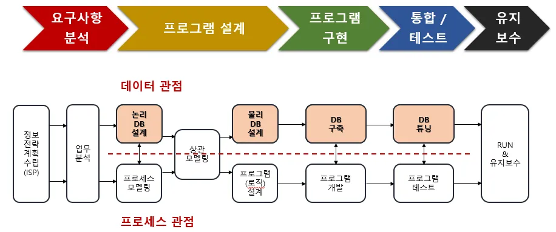

        - 폭포수 모델 방식의 소프트워어 개발 절차는 요구사항 분석, 설계, 구현, 테스트, 튜닝, 유지보수 이다. 
        - 데이터 관점 모델링
            - 어떤 것과 관련 있는지, 데이터 간의 관계, 튜닝까징 과정에 포함이 된다.
    - 데이터 모델 표기법 
        - Barker 표기법 VS IE 표기법

            
            
            - 선과, 끝부분의 바를 잘보자
                - 실선(필요) 둘다 무조건 매칭, 점선(참조) 매칭이 안돼도 상관 없다
            - 범용은 IE 표기법 
            - 우리는 Barker 표기법을 사용 할 것이다.
    - 관계형 모델(Relational Model)
        - 
             - 릴레이션 이름 = 테이블 명 
             - 식별자 = PK
             - 어트리뷰트 값 = 식별자 값을 제외 한 값
    - 무결성
        - **관계형 모델에서 가장 중요**
        - 데이터가 모순없이 일관 되게 일치하면서 데이터가 **틀리지 않고 정확** 해야 한다. 
        - 종류 및 설명 

            | **무결성 종류** | **무결성 특징** |
            | --- | --- |
            | 엔터티 무결성(Entity Integrity) | 모든 인스턴스는 고유해야 하며 인스턴스를 대표하는 속성에는 널 값을 가지면 안된다는 의미 |
            | 참조 무결성(Referentail Integrity) | 엔터티의 외래 식별자 속성은 참조하는 엔터티의 주 식별자 값에 포함되거나 널이어야 함을 의미 |
            | 도메인 무결성(Domain Integrity) | 속성 값과 관련된 것으로 특정 속성 값은 같은 데이터 타입, 길이, 널 여부, 중복 값 허용, 기본 값 등 동일한 범주의 값만 존재해야 함을 의미 |
            | 업무 무결성(Business Integrity) | 기업에서 업무를 수행하는 방법이나 데이터를 처리하는 규칙을 의미 |   

            - 테이블을 만들때에는 **무결성규칙**을 위배하지 않도록 주의해서 만들어야 된다. 

---

- 2월 18일 화요일 - 데이터베이스 모델링2
    - 엔터티 
        - 업무의 관심 대상이 되는 정보를 갖고 있거나 그에 대한 정보를 알아야 하는 유,무형의 개체
    - 엔터디 도출 
        - 업무 관심 대상
        - 두 개 이상의 인스턴스(개체)
        - 데이터 정체성이 분명
        - 식별자가 존재 
        - 동일한 성격의 데이터는 X 하나만 가능
        - 엔터티 명은 관리하고자 하는 성격을 가장 잘 표현한 이름 이여야 한다. 
    - 엔터티 종류 
        - 실체 엔터티
        - 기준 엔터티
        - 행위 엔터티
        - 가공 엔터티
    - 속성
        
        - 단일 속성
            - 하나의 의미로 구성 된 속성
            - ex) 부서명, 상품명
        - 복합 속성
            - 두 개 이상의 세부속성으로 구성된 속성
            - ex) 주소(시, 구, 동)
        - 다가 속성
            - 속성이 여러 값을 지니는 속성
            - ex) 주문 내역, 입출고 내역, 걀제 내역
        - 기초 속성
            - 기초 속성만으로 엔터티가 어떤 성격을 지니고 있는지 알아볼 수 있어야 한다.
        - 관계 속성
            - FK 다른 엔터티와의 연관성을 나타내는 속성
        - 추출 속성
            - 원본 속성의 값을 계산해서 채우는 속성
            - ex) 상품의 총 금액
    - 식별자 
        - 주식별자
            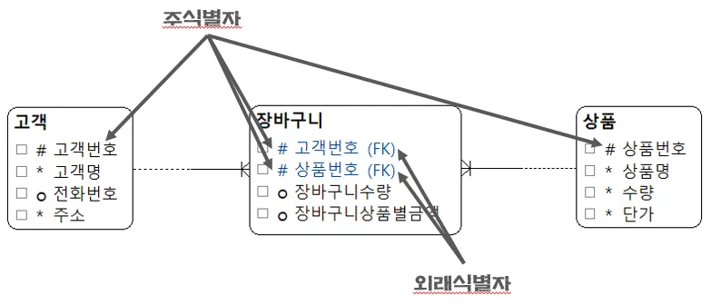
            - 유일성
            - 최소성
            - 불변성
            - 존재성
                - NULL 허용 X
            - 주식별자는 여러개 일 수 이다, 
        - 외래식별자
            - 부모와 자식 두 엔터티에서 부모의 주식별자가 자식에게는 외래식별자가 된다.  
    - 관계
        - 카디널리티
            - 1:1 (이런경우는 거의 없음,  조회할때 시간 낭비를 하기 때문)
            - 1:N (이런경우가 대부분, 굳)
            - N:M (이런경우는 거의 없음, 잘 못 만들었을 가능성이 높음)
        - 옵셔널리티
        - 관계 디그리
    - 특별한 관계
        - 일대일 관계 
            
            - 필요한 상황이 아니라면 일대일 관계를 만들지 않는다
            - Join 할 때 시간 낭비 
        - 베타 관계 
            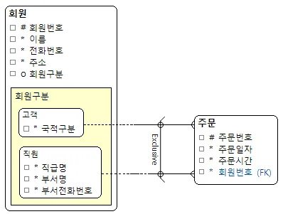
            - 프로젝트에서 할 일은 거의 없다 
        - 재귀 관계 
            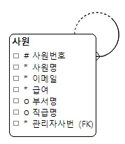
            - 레벨이 존재하지 않는 데이터에서 사용 
            - ex) 나 사원 사수 사원 

---
 
 - 2울 18일 화요일 - 데이터베이스 모델링 3
    - 개념 모델
        
        - 요구을 이해하는 관계자들이 이해할 수 있도록 데이터로 간결하게 표현하는 것
        - 충분한 의사소통이 필요하다

--- 

- 2월 18일 화요일 - 데이터베이스 모델랑 4
    - 이상 
        - 삽입 이상
            - 필요한 속성을 넣지 않고 삽입을 하는 것
        - 갱신 이상
            - 속성 값이 바뀔때 동일 한 속성 값이 모두 바뀌지 않는것
        - 삭제 이상
            - 상품을 삭제할때 주문내역도 삭제 되는 것
            - 주문내역을 삭제할때 상춤도 삭제 되는 것
    - 논리 모델
        - 정규화를 진행하는 단계
        - 중복값을 제거하여 이상현상을 제거하기 위해 속성 간에 종속 관계를 확인하고 엔터티를 분할한다. 
        - 빠짐없이 정확하게 반영해야 한다.
        - 삭제할 엔터티나 속성이 없어야 한다.
        - 지나치게 성능 문제를 해걀할고 하지 않는다(정확성이 우선)
    - 정규화
        - 중복데이터 제거
        - 안정성
        - 확장성
        
        - 1정규형 (반복 속성 제거)
            - 다가 속성 관련
            
            - 반복 속성 제거
            - 다가속성이 제일 먼저 제거 됨(모든 속성은 반드시 하나의 값을 가져야 한다.)
            - 원자값을 가짐
            - 복합 속성 관련
            
        - 2정규형 
            
            - 부분 함수적 종속 제거, 기본키 그룹에 완전하게 함수적 종속 
        - 3정규형
            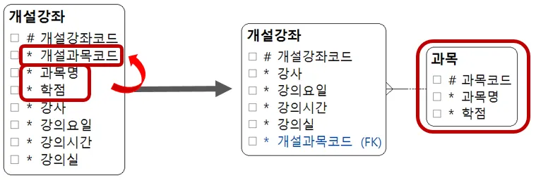
            - 이행적 함수적 종속 제거, 키가 아닌 모든 속성이 기본키에 직접 종속
        - BCMF
            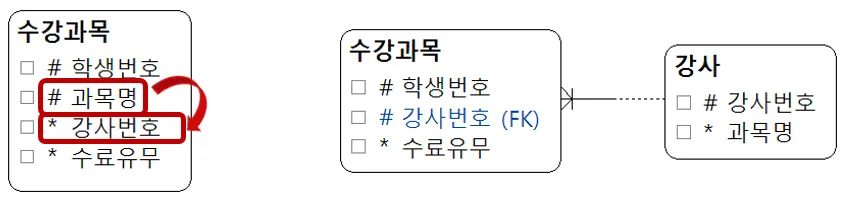
            - 후보키가 아닌 결정자 제거
        - 4정규형
            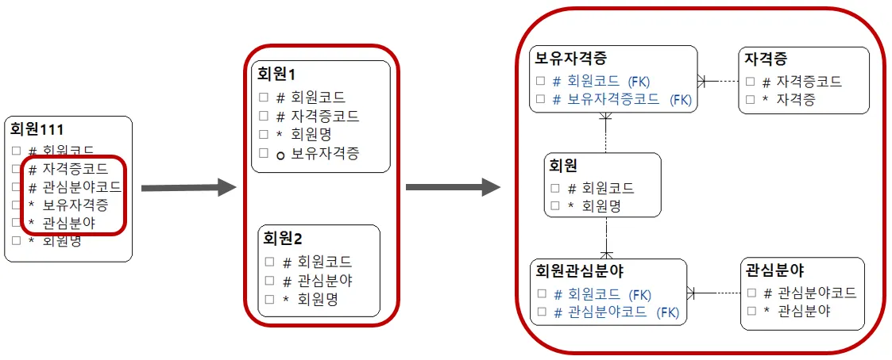
            - 다치종속 제거
         - 5정규형 
            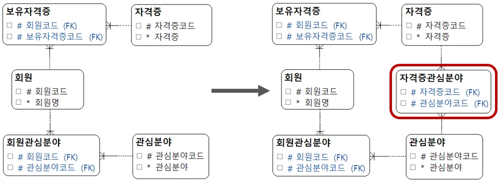
            - 종인 종속석 이용

---

- 2월 19일 수요일 - 데터베이스 모델링 4
    - 물리모델
        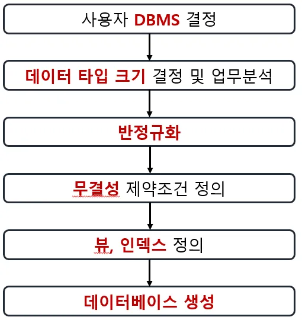
        - 물리모델의 목적
            - 성능을 최적화 하기 위해 성능을 거려하여 엔터티를 합치거나 모델 구조를 약간 변경 할 수 있다.
        - 주의 사항
            - 모델구조는 10% 이내의 변화 
            - 비정규화 특정 성능 문제를 해결하기 위한 목적이 아니면 안한다.
            - 슈퍼타입과 서브관계의 물리적 변화을 한다.
    - 슈퍼타입과 서브타입
        - 슈퍼타입, 서브타입
            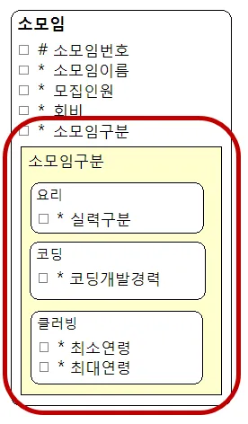
            - 노란 부분이 서브타입, 다른 부분이 슈퍼타입이다.
        - 서브타입의 물리모델 변환
            - 통합 엔터티로 변환

            | **장점** | **단점** |
            | --- | --- |
            | 서브타입 구분 없는 데이터 접근이 간편하다 (조회 시 조인이 필요없다.) (Entity Integrity) | 테이블의 컬럼 수가 증가된다. |
            | View를 활용해 각 서브타입 조회 및 수정이 가능하다. | 서브타입 별로 처리 시 서브타입의 구분이 필요해 지는 경우가 많다. |
            | - | 특정한 서브타입을 NOT NULL로 제한할 수 없다. |

            - 각 서브타입마다 하나의 엔터티로 변환

            | **장점** | **단점** |
            | --- | --- |
            | 서브타입 별로 처리 시 서브타입의 유형 구분이 불필요하다.(Entity Integrity) | 전체적인 데이터를 처리하는 경우 UNION이 발생한다. |
            | 단위 테이블의 크기가 감소한다. | 여러 테이블을 합친 View는 조회만 가능하며 인스턴스를 개별적으로 구분하기 위한 UID 유지 관리가 어렵다. |
            | 불필요한 컬럼이 줄어든다. | 복잡한 SQL 처리 시 통합이 어렵다. |

    - 성능개선
        - 뷰(가상 테이블)
        - 비정규화
            - 성능향상, 개발 과정의 편의성, 운영 단수화를 위해 중복을 감수하고 성능을 향상시키기 위해 한다.
            - 수직 분할
                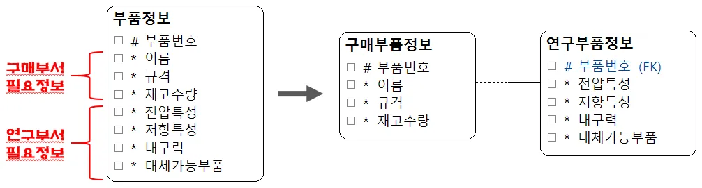
                - 카디널리티는 1:1, 데이터량을 줄여 검색 속도 업
            - 수평 분할
                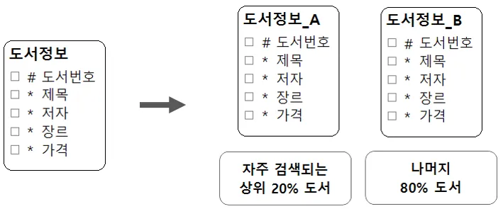
                - 검색빈도에 따라 나눔
            - 속성 중복
                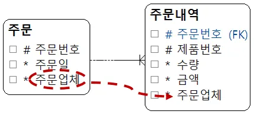
                - 데이터 무결성이 깨질 수 있고, 입력,수정,삭제에 있어 응답이 늦어질 수 있다.
            - 엔터티 통합
                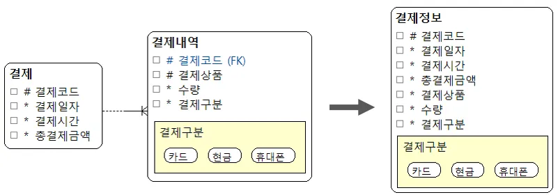
                - 조인연산에 걸리는 시간을 단축시켜준다, 이상현상이 발생 할 수 있다.

---

- 2월 19일 수요일 - 데이터베이스 DDL
    - CREATE
        CREATE TABLE IF NOT EXISTS tb1 (
            pk INT PRIMARY KEY,
            fk INT,
            col1 VARCHAR(255),
            CHECK(col1 IN ('Y', 'N'))
        ) ENGINE=INNODB;
        - tb1이라는 이름으로 테이블 만들기
    - drop
        - 삭제후 재생성, 테이블안을 초기화 해주는 것
    - TRUNCATE
        - 절대 쓰지 말기 , 진짜 그냥 데이터가 완전 아예 날아감

---

- 2월 19일 수요일 - 데이터베이스 constraints
    - NOT NULL
        - NULL 값을 허용하지 않는다
    - UNIQUE
        - 중복을 허용하지 않는다.
        - PK를 설명하기 위해서 
        - 사용법 : phone VARCHAR(255) NOT NULL UNIQUE OR UNIQUE (phone)
    - PRIMARY KEY
        - NOT  NULL +  UNIQUE 하다.
        - 테이블에서 식별자 역할을 한다. 
        - 한 테이블당 한 개만 설정할 수 있음
        - 사용법 :  user_no INT PRIMARY KEY OR PRIMARY KEY (user_no)
    - FOREIGN KEY
        - 참조된 다른 테이블에서 제공하는 값만 사용할 수 있음
        - 시용법 : FOREIGN KEY (grade_code) REFERENCES user_grade (grade_code)
    - CHECK
        - 제약조건을 확인하고 그에 맞는지 확인 하는 것
        - 사용법 : gender VARCHAR(3) CHECK (gender IN ('남','여')), age INT CHECK (age >= 19)
    - DEFAULT 
        - 기본적으로 들어갈 값
        - 사용법 : add_time DATETIME DEFAULT (current_time)
    
---

- 2월 18일 수요일 - 데이터베이스 INDEX, VIEW
    - INDEX
         - 데이터를 빠르게 조회 할 수 있도록 도와줌
         - 인덱스도 저장공간을 차지하고 수정할때 인덱스도 수정을 해줘야 돼서 신중하게 결정을 해야된다.
    - VIEW
        - 가상의테이블, 물리적 저장하지 않고 쿼리만 저장
        - VIE를 통한 DML
            - 아래의 3개가 불가능 한 경우도 있다. 
        - VIE를 통한 INSERT
            - NULL을 넣으면 에러가 뜬다
        - VIEW를 통한 UPDATE
        - VIEW를 통한 DELETE
    
--- 

- 2월 18일 수요일 - 데이터베이스 STORED PROCEDURE, TRIGER
    - 미리 컴파일되어 데이터베이스에 저장된 SQL문의 집합
    
    | 장점 | 단점 |
    | --- | --- |
    | 복접한 SQL을 만들어 여러곳에서 재사용 가능 | 오류 발생시 추적이 어려워 디버깅이 어렵다 |
    | 미리 컴파일되어 저장되어 실행 속도가 빠르다 | DBMS로의 이식이 어렵다 |
    | 엑세스 로직을 캡술화하여 보안을 높일 수 있다 | 로직이 과해지면 유지보수가 어려워진다 |
    | 네트워크 트랙픽을 감소시키다 |  |

    - 생성방법

        -- 기존 DELIMITER 변경
        DELIMITER $$

        -- 기존에 존재한다면 삭제
        DROP PROCEDURE IF EXISTS get_menu_list$$

        -- Stored Procedure 생성
        CREATE PROCEDURE get_menu_list()
        BEGIN
            SELECT * FROM tbl_menu;
        END$$

        -- DELIMITER 원래대로 복구
        DELIMITER ;

        -- 생성된 Stored Procedure 호출
        CALL get_menu_list();

    - IN,OUT
        - IN
            - 호출 시 값을 전달받아 프로시저 내에서 사용
        - OUT
            - 실행 후 값을 반환한다
        - INOUT
            - 값을 전달바고, 반환한다.
    - TRIGER
        -  특정 데이터 변경 이벤트가 발생할 때 자동으로 실행되는 저장된 프로시저의 한 종류

--- 

- 2월 19일 수요일 - 데이터베이스 백업 및 복원
    - 백업
        - 논리적 백업
            - 데이터베이스 구조와 데이터를 SQL 문자으로 덤프하여 저장하는 방법
            - 이식성이 높고 특정 데이터 백업 가능하지만, 대용량의 경우 시간이 오래 걸린다
            - mysqldump 유틸리티 사용
        - 물리적 백업
            - 데이터 파일 자체를 복사하여 백업하는 방법
            - 속도가 빨라 대용량에 좋지만, 동일한 OS와 파일 시스템 환경이 필요하다는 제한점이 있다.
            - mysqlhotcopy , 파일 시스텀 보가 등을 사용
--

- 2월 20일 목요일 - SQL문
    - sql 파일로 정리 해둠
    - 순서
        - SELECT (DISTINCT) -3
        - FROM -1
        -  WHERE -2 
        - GROUP BY -4
        - HAVING -5
        - WITH ROLLUP  -6
        - ORDER BY -7
        - LIMIT -8

---
 
- 2월 20일 목요일 - 데이터베이스의 DML
    - DML 
        - 데이터 조작언어, 테이블에 값을 삽입,수정,삭제하는 SQL
    - INSERT
            -- INSERT INTO 테이블명 VALUES (컬럼순으로, 삽입할, 데이터, 나열, ....)
            INSERT INTO tbl_menu  VALUES (null, '곰탕', 9500, 6, 'Y');

            -- INSERT INTO 테이블명 (컬럼명1, 컬럼명2, 컬럼명3, ...)
            -- VALEUS (데이터1, 데이터2, 데이터3, ...)
            INSERT INTO tbl_menu(menu_code, menu_name, menu_price, orderable_status, category_code)
            VALUES (null, '차돌짬뽕', 15000, 'Y', 6);

            INSERT INTO tbl_menu(menu_name, menu_price, category_code, orderable_status)
            VALUES('만잔라떼', 4500, 7, 'Y');

            -- MULTI INSERT
            INSERT INTO tbl_menu
            VALUES
            (null, '유자민트티', 6900, 7, 'Y'),
            (null, '프렌치프라이', 7500, 7, 'Y'),
            (null, '훈제오리셀러드', 9500, 7, 'Y');

            -- AUTO INSERT의 단점, 100점으로 넣으면 그앞에 많은 수가 비어 있어도 다음에 넣는 것은 101로 들어감
            -- INSERT INTO tbl_menu VALUES (100, '1번 음식', 100, 10, 'Y');
    - UPDATE
        -- UPDATE 테이블명 
        -- 	SET 컬럼명1 = 수정할 데이터,
        -- 		컬럼명2 = 수정할 데이터,
        -- 		...
        -- [ WHERE 수정 대상 데이터 조건 ];

        UPDATE tbl_menu
            SET menu_name = '100번이였던 음식',
                menu_price = 19000
        WHERE menu_code = 100; -- SET UPDATE MODE가 설정되어 있으면 WHERE절 없이 수정 불가 
    - DELECT
        -- DELETE FROM 테이블명 [ WHERE 삭제 조건];

        DELETE 
            FROM tbl_menu
            WHERE menu_code = 101;
            
        DELETE 
            FROM tbl_menu
        ORDER BY menu_code DESC
        LIMIT 3;

        DELETE
            FROM tbl_menu
        WHERE menu_code = 26;
    - REPLACE
        -- DELETE FROM 테이블명 [ WHERE 삭제 조건];

        DELETE 
            FROM tbl_menu
            WHERE menu_code = 101;
            
        DELETE 
            FROM tbl_menu
        ORDER BY menu_code DESC
        LIMIT 3;

        DELETE
            FROM tbl_menu
        WHERE menu_code = 26;

---

- 2월 20일 목요일 - 데이터베이스 JOIN
    - 별칭
        SELECT
            a.category_code,
            a.menu_name
        FROM
            -- tbl_menu AS a
            tbl_menu a          #a.이름 으로 별칭을 설정해준다.
        ORDER BY 
            a.category_code,
            a.menu_name;
        - 별칭은 지정을 해줘야됨 다른테이블에 같은 이름의 컬럼이 있을 수 있기 때문에 별칭 지정을 통해서 알 수 있도록 해준다.
    - JOIN 
        - INNER JOIN 
            SELECT 
                a.menu_name,
                b.category_name
            FROM 
                tbl_menu a
            -- INNER JOIN tbl_category b ON a.category_code = b.category_code;
            JOIN tbl_category b ON a.category_code = b.category_code;           # 연결해줄 커럼을 연결(PK와 FK연결)해서 JOIN해라
        - OUTER JOIN
            - LEFT JOIN
                SELECT 
                    a.category_name,
                    b.menu_name
                FROM 
                    tbl_category a
                LEFT JOIN tbl_menu b ON a.category_code = b.category_code; # a.tbl_category를 기준으로 표를 만듬
            - RIGHT JOIN
                SELECT 
                    a.menu_name,
                    b.category_name
                FROM 
                    tbl_menu a
                RIGHT JOIN tbl_category b ON a.category_code = b.category_code; # b.tbl_category를 기준으로 표를 만듬
        - CROSS JOIN
        - SELF JOIN

---

- 2뤌 20일 목요일 - 데이터베이스, python 연결
    # pip  install mysql-connector-python 

    import mysql.connector

    connection = mysql.connector.connect(
        host = 'localhost',
        user = 'ohgiraffers',
        password = 'ohgiraffers',
        database = 'menudb'   
    )

    cursor = connection.cursor()  

    sql = "UPDATE tbl_menu SET menu_name = %s , menu_price = %s WHERE menu_code = 1"      # 쿼리문을 작성 하면 된다.
    value = ('쌀국수', 15000)                                                               # 이렇게 보내야 한전한 방법.

    cursor.execute(sql,value)

    connection.commit()     # commit을 꼭 해줘야 내용이 반영 된다.

    print(f'{cursor.rowcount}개의 행이 업데이트 되었습니다.')

    cursor.close()   
    connection.close()
