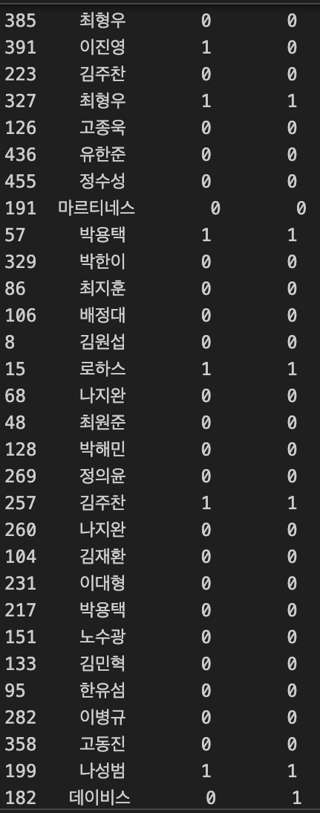
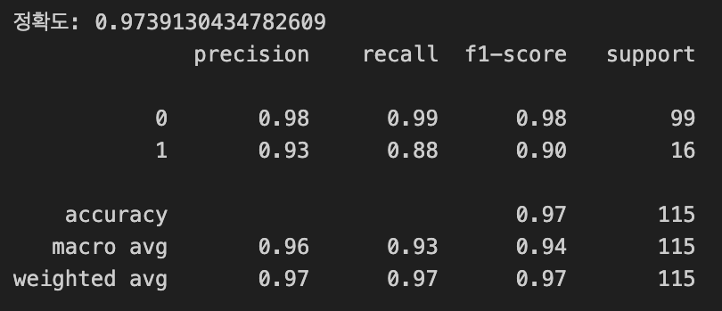

# EDA-1Team

# 팀명 : TNT 팀

## 팀원 소개 

| 김장수 | 이채은 | 황준호|
| --- | --- | --- |
|  |  |  |
| 
INTP
 | 
INTP
 | 
ENTJ
 |
# 프로젝트 주제 : ⚾️KBO 외야수 골든글러브 수상 예측을 위한 데이터 분석 프로젝트⚾️

# 📅 개발 기간
**2025.03.10 ~ 2025.03.12 (총 3일)**

##  🎯 프로젝트 목표

- **목적**:

  - 2000년부터 2024년까지 KBO 외야수 중 연도별 WAR 상위 20명(약 400명)의 경기기록 데이터를 분석하여 골든글러브 수상 여부와 주요 성적 지표 간의 관계를 탐색하고, 모델학습을 위한 EDA 및 데이터 전처리를 수행하는 것이 목표이다.

- **접근 방식**:
  - 골든글러브 수상자는 경기 성적을 바탕으로 매년 기자단 투표를 통해 선정되며, 타율, WAR, 홈런, OPS 등 다양한 성적 지표의 영향을 받는다. 이에 해당 되는 연도별 데이터 개별 CSV 파일로 수집하고, 이를 통합하여 분석을 진행했다.
  - 주요 성적 지표와 골든글러브 수상 여부 간의 관계를 분석하고, 모델 학습을 위한 데이터 정리 및 전처리를 진행했으며, 모델 적용을 위한 특징 선택 및 정규화 과정을 수행하였다.
   
- **타겟 변수**: **`골든글러브 수상 여부`** (1: 수상, 0: 미수상)

- **기대 효과** :
   1. 선수 성적 기반 골든글러브 수상 가능성 예측(특정 시즌에서 수상 가능성이 높은 선수를 사전에 예측 가능)
   2. 새로운 시즌 성적 데이터를 입력하면 골든글러브 수상 가능성이 높은 선수 추천 가능
   3. 야구 팬 및 관계자들에게 유용한 인사이트 제공

## 1.데이터 구성 

### 📂 **연도별 데이터 파일 목록**
각 연도의 외야수 데이터를 개별 CSV 파일로 정리

| 연도  | 데이터 파일명       | 설명 |
|------|----------------|-------------------------------|
| 2000 | `data/2000.csv` | 2000년도 외야수 성적 데이터 |
| 2001 | `data/2001.csv` | 2001년도 외야수 성적 데이터 |
| ...  | ...            | ... |
| 2023 | `data/2023.csv` | 2023년도 외야수 성적 데이터 |
| 2024 | `data/2024.csv` | 2024년도 외야수 성적 데이터 |

### 📊 **연도별 데이터 샘플 ex. '2000.csv'**  
각 연도별 CSV에는 아래와 같은 성적 지표가 포함 

| 이름  | 연도  | WAR  | 득점 | 안타 | 2루타 | 3루타 | 홈런 | 타점 | 도루 | 볼넷 | 사구 | 고의사구 | 삼진 | 병살 | 희생타 | 희생플라이 | 타율  | 출루  | 장타  | OPS   | wRC+  | 수상여부 |
|------|------|------|------|------|------|------|------|------|------|------|------|------|------|------|------|------|------|------|------|------|------|------|
| 송지만  | 2000 | 5.61  | 93   | 158  | 33   | 2    | 32   | 90   | 20   | 52   | 7    | 2      | 72   | 10   | 0    | 3    | 0.338 | 0.409 | 0.622 | 1.031 | 169.4  | 1 |
| 박재홍  | 2000 | 5.26  | 101  | 151  | 31   | 5    | 32   | 115  | 30   | 64   | 7    | 5      | 77   | 15   | 0    | 12   | 0.309 | 0.388 | 0.589 | 0.977 | 150.3  | 1 |
| ...    | ...  | ...   | ...  | ...  | ...  | ...  | ...  | ...  | ...  | ...  | ...  | ...    | ...  | ...  | ...  | ...  | ...   | ...   | ...   | ...   | ...    | ... |
| 김응국  | 2000 | 1.03  | 57   | 111  | 15   | 3    | 6    | 45   | 9    | 34   | 2    | 4      | 78   | 7    | 1    | 1    | 0.277 | 0.336 | 0.374 | 0.710 | 86.5   | 0 |
| 채종범  | 2000 | 0.24  | 55   | 113  | 22   | 5    | 8    | 52   | 5    | 35   | 9    | 1      | 59   | 10   | 13   | 4    | 0.247 | 0.311 | 0.370 | 0.681 | 72.0   | 0 |

### 🔹 `yearly_averages_csv`
각 연도별 **주요 성적 지표(8개)** 평균값

| 연도  | WAR  | 타율  | 홈런  | 장타  | OPS  | wRC+  | 안타  | 출루  |
|------|------|------|------|------|------|------|------|------|
| 2000 | 3.264 | 0.293 | 17.833 | 0.479 | 0.847 | 121.872 | 134.056 | 0.368 |
| 2001 | 3.211 | 0.303 | 14.053 | 0.468 | 0.858 | 126.895 | 129.211 | 0.390 |
| 2002 | 3.393 | 0.285 | 15.722 | 0.451 | 0.815 | 123.556 | 125.333 | 0.364 |
| ...  | ...   | ...   | ...   | ...   | ...   | ...   | ...   | ...   |
| 2022 | 3.936 | 0.295 | 13.474 | 0.442 | 0.812 | 130.400 | 149.263 | 0.369 |
| 2023 | 3.006 | 0.290 | 8.765  | 0.412 | 0.773 | 118.294 | 135.118 | 0.360 |
| 2024 | 2.879 | 0.299 | 14.737 | 0.453 | 0.830 | 116.368 | 147.421 | 0.377 |

## 🧹 EDA

### 1. 데이터 로드

  
  **연도별 개별 CSV → 하나의 통합 CSV 파일 생성**
  - `glob.glob("data/*.csv")` 를 이용해 data 폴더 내 모든 CSV 파일을 가져옴 → **'all.csv'** 파일에 통합하여 저장

### 2. 데이터 구조 및 기초 통계 확인

  
### 3. 결측치 및 이상치 탐색
  - 결측치 : 도루 **458개 중 406개만 값이 있음**
      → 52개 결측치(NaN) 존재 *(나머지 컬럼은 결측지 없음)*
  - 이상치 : WAR, 홈런, 도루, wRC+, OPS 등의 컬럼에서 최대값이 평균 및 Q3(75%) 값을 크게 초과
      → 이상치 가능성 높음

### 4. 데이터 시각화를 통한 탐색

   #### 1️⃣골든글러브 수상여부 분포 : 골든글러브 수상자(1)와 미수상자(0)의 데이터 분포를 나타낸 그래프
  
  - 골든글러브 수상자(1)와 미수상자(0)의 데이터 분포를 나타낸 그래프
  - 수상하지 못한 선수(0)가 수상한 선수(1)보다 훨씬 많음 → **데이터 불균형 존재**
  - 전체 데이터 중 약 21%만 수상(1)했으며, 대부분은 미수상(0) 상태

   #### 2️⃣ 야구 성적 지표 간의 상관관계 : KBO 외야수 성적 지표 간의 상관관계를 나타낸 히트맵(Heatmap)
   
  - WAR, OPS, wRC+ 등 주요 성적 지표들이 서로 얼마나 강한 관계를 가지는지 시각적으로 표현
  - 색상(파란색~빨간색)으로 상관계수의 크기를 나타냄
      - 빨간색(1에 가까움): 강한 양의 상관관계 (서로 비례)
      - 파란색(-1에 가까움): 강한 음의 상관관계 (서로 반비례)
      - 흰색(0에 가까움): 거의 상관없음
  - 홈런과 장타율(0.89), OPS와 장타율(0.97) 등 일부 변수는 높은 상관관계를 가짐
  - 출루율과 WAR(0.75), OPS와 wRC+(0.88)도 강한 관계를 보임

    #### 3️⃣ 결측치 개수 확인 결과
    
    
  - 대부분의 컬럼에서 결측치 없음 (0으로 표시됨)
  - 도루 컬럼에 결측치(NaN) 52개 존재

    
    #### 4️⃣ 주요 성적 지표의 분포 및 이상치 탐색 : 박스플롯(Boxplot)을 활용하여 주요 성적 지표의 분포와 이상치 분석
     
    
    - 위의 그래프에서 원으로 표시된 값들은 **이상치(outliers)** 로, 다른 데이터와 큰 차이를 보이는 값들
    - ex) 홈런, wRC+, OPS 등 일부 지표에서 **극단적인 이상치가 관찰됨**
     
      ⚠️ 선수의 뛰어난 성과를 반영하는 경우가 많아, **데이터의 의미를 보존하기 위해 제거하지 않고 유지함.**

### 5. 데이터 정제 및 전처리
  #### 1️⃣ 수상 예측에 유의미하다고 판단되는 feature 추출
  
  
  -> 컬럼 제거: `df_new = df.drop(columns=['이름', '득점', '2루타', '3루타', '타점', '도루', '볼넷', '사구', '고의사구', '삼진', '병살', '희생타', '희생플라이'])`

  #### 2️⃣ 표준화 : 연도마다 변하는 수상 기준과 연도별 데이터의 특징 변화(ex. 제도 변경으로 인한 경기 내용 변화)를 반영하기 위함
  - 연도별 데이터 평균 추출

  
     

  - 기존 데이터 - 연도별 데이터 평균 (표준화 진행 전)

  
  #### - `scaler = StandardScaler()`
    
### 6. 데이터 분할 및 학습
  
  
  #### - 표준화된 train 데이터를 이용하여 K-NN 학습 진행
  #### - test 데이터의 비율 : 25%
      
### 7. 예측 및 결과 평가

  #### - target값(수상여부) 불균형 : 대부분의 인원이 골든글러브 수상 x
  

  #### - 실제 예측 결과

  

  ## ✅결론 (평가 지표 확인-Classification_report)
  
  
  이번 프로젝트에서 사용한 데이터는 수상에 실패한 인원이 385명, 수상에 성공한 인원이 75명으로 클래스 불균형이 존재한다.  
  따라서 골든글러브 수상에 실패한 인원을 정확히 예측한 케이스가 많기 때문에 정확도가 약 0.97 으로 꽤 높은 수치를 보이지만  
  **실제 골든글러브 수상 인원을 모델이 수상했다고 판정한 비율을 알려주는 Recall(재현율)의 수치를 확인하는 것이 유의미하다.**  
  최종적으로 모델 학습 결과, 88% 확률(**Recall**)로 실제 골든글러브 수상 인원을 정확히 예측하였다.     
